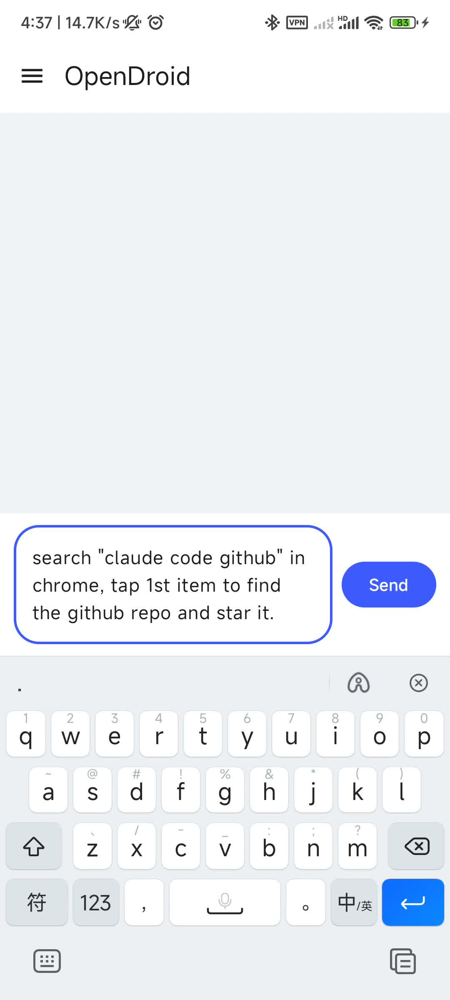
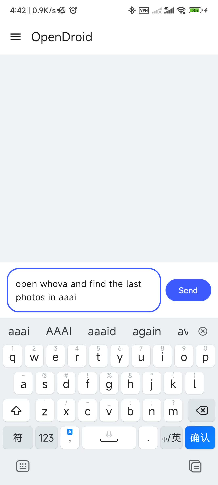
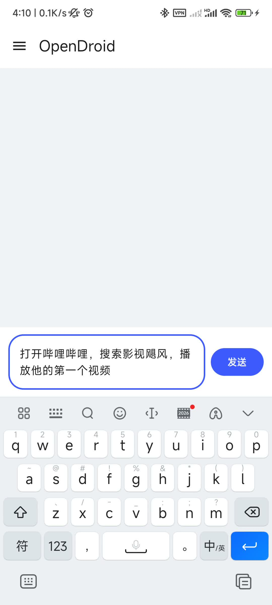
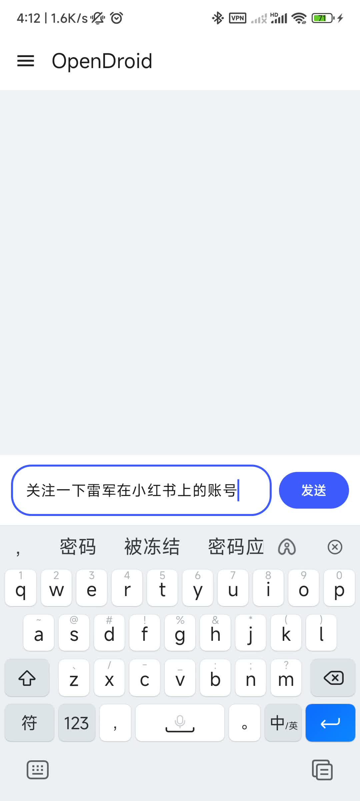

<picture>
  <source media="(prefers-color-scheme: dark)" srcset="./icon.png">
  <source media="(prefers-color-scheme: light)" srcset="./icon.png">
  
</picture>

# OpenDroid

[简体中文](./README.zh-CN.md)

## Introduction

OpenDroid runs the **agent on your Android device** and calls a **cloud LLM over HTTP API**. Conversation drives a tool chain that **reads the current screen** and performs taps, swipes, and similar actions; when needed it can also supply **light screenshots** to vision-capable models. **Skills** capture reusable workflows.

---

## Installation

We ship a ready-to-install **APK**. Download the latest package from the **Releases** page of this repository and install it on your phone (**Android 8.0 or higher**, API **26+**). Allow installation when your system and install source prompt you to.

---

## Quickstart

For a **setup walkthrough** on video, see [YouTube](https://www.youtube.com/shorts/MHWSLME-k7Q).

1. Open system **Settings → Accessibility**, find **OpenDroid**, and **turn the accessibility service on**. On **Android 12+**, if the system asks, also allow the service’s **screenshot**-related permission, or the app cannot provide full-screen capture capabilities for vision models.
2. Enable **Display over other apps** (floating window) for OpenDroid so overlays and foreground behavior work normally during tasks. The location varies by device; it is often under **Settings → Apps → OpenDroid** in the relevant permissions page, or open **App info** / per-app settings from **Recents** (long-press the app card or icon) and enable it there.
3. Open OpenDroid, fill in **API** details (you can keep defaults if the build ships them), then enable the in-app **floating window** as needed.
4. Go to **Chat**, describe your goal in natural language, and **try not to use the phone manually** while the agent runs so automation is not interrupted.

---

## Demo videos

Short **Mobile AI Agent** demos on YouTube.

1. **Mobile AI Agent stars a GitHub repo**

   

2. **Mobile AI Agent views the latest photos in the app**

   

 

3. **Mobile AI Agent plays a short in the video app**

   

 

4. **Mobile AI Agent follows a social account**

   

 

---

## Contributing

Contributions are welcome! Please feel free to submit a Pull Request.
